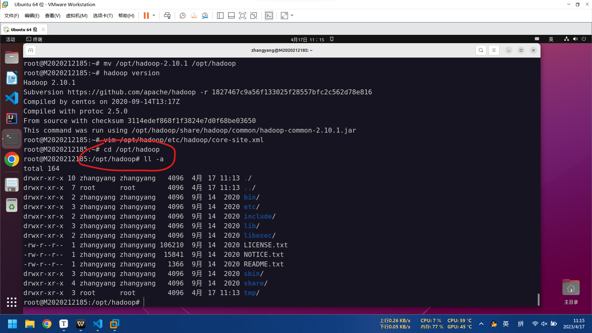
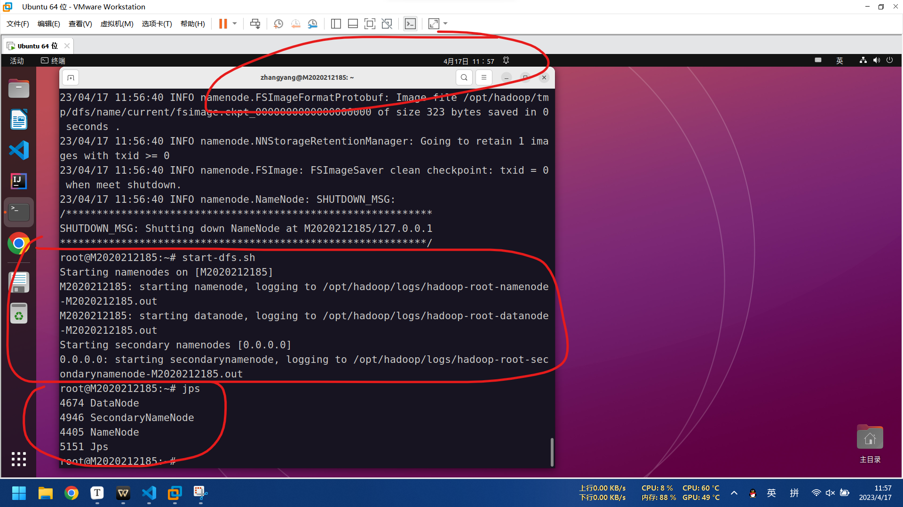
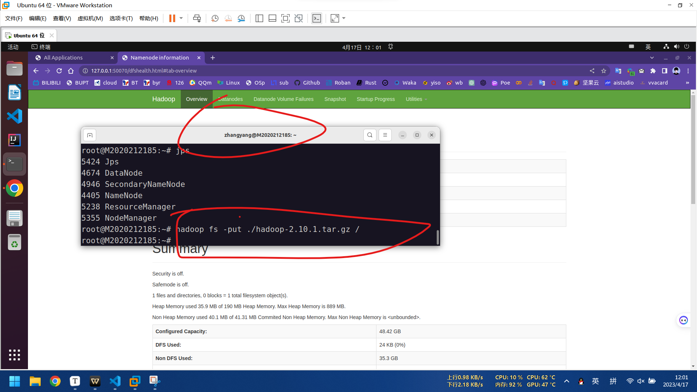

# hadoop大数据实验集群搭建

**张扬2020212185**

**付驰2020212135**

**陈昊华2020212194**

**思维导图：**


[TOC]

## 一、Ubuntu 单机伪分布 Hadoop 环境配置

### 安装 JDK

执行以下命令，下载 JDK1.8 安装包。解压下载的 JDK1.8 安装包。移动并重命名 JDK 包

```shell
wget https://download.java.net/openjdk/jdk8u41/ri/openjdk-8u41-b04-linux-x64-14_jan_2020.tar.gz
tar -zxvf openjdk-8u41-b04-linux-x64-14_jan_2020.tar.gz
mv java-se-8u41-ri/ /usr/java8
```

执行以下命令，配置 Java 环境变量。

```shell
echo 'export JAVA_HOME=/usr/java8' >> /etc/profile
echo 'export PATH=$PATH:$JAVA_HOME/bin' >> /etc/profile
source /etc/profile
```

java配置完成

**2020212185的截图：**


执行以下命令，查看 Java 是否成功安装。

```shell
java -version
```

java安装成功

**张扬2020212185的截图：**


### 安装 Hadoop

执行以下命令，下载 Hadoop 安装包

```shell
wget --no-check-certificate https://mirrors.bfsu.edu.cn/apache/hadoop/common/hadoop-2.10.1/hadoop-2.10.1.tar.gz
```

执行以下命令，解压 Hadoop 安装包至/opt/hadoop。

```shell
tar -zxvf hadoop-2.10.1.tar.gz -C /opt/
mv /opt/hadoop-2.10.1 /opt/hadoop
```

**张扬2020212185的截图：**



执行以下命令，配置 Hadoop 环境变量。

```shell
echo 'export HADOOP_HOME=/opt/hadoop/' >> /etc/profile
echo 'export PATH=$PATH:$HADOOP_HOME/bin' >> /etc/profile
echo 'export PATH=$PATH:$HADOOP_HOME/sbin' >> /etc/profile
source /etc/profile
```

**张扬2020212185的截图：**


执行以下命令，测试 Hadoop 是否安装成功。

```shell
hadoop version
```

**Hadoop 安装成功**

**张扬2020212185的截图：**


### 配置 Hadoop

1.修改 Hadoop 配置文件 `core-site.xml`

a. 执行以下命令开始进入编辑页面。

```shell
vim /opt/hadoop/etc/hadoop/core-site.xml
```

b. 在`<configuration></configuration>`节点内插入内容:

**张扬2020212185的截图：**


2.修改 Hadoop 配置文件 `hdfs-site.xml`

a. 执行以下命令开始进入编辑页面。

```shell
vim /opt/hadoop/etc/hadoop/hdfs-site.xml
```

b. 在`<configuration></configuration>`节点内插入内容：

**张扬2020212185的截图：**


**张扬2020212185的截图：**


### 配置 SSH 免密登录

1、执行以下命令，创建公钥和私钥。

```shell
ssh-keygen -t rsa
```

**张扬2020212185的截图：**


2、执行以下命令，将公钥添加到 authorized_keys 文件中。

```shell
cd .ssh
cat id_rsa.pub >> authorized_keys
```

**张扬2020212185的截图：**


### 启动 Hadoop

1、初始化 namenode

```shell
hadoop namenode -format
```

2、依次执行以下命令，启动 Hadoop。

```shell
start-dfs.sh
```

**张扬2020212185的截图：**



```shell
start-yarn.sh
```

**张扬2020212185的截图：**


3.启动成功后，执行以下命令，查看已成功启动的进程。

```shell
jps
```

**张扬2020212185的截图：**


4、打开 `hdfs` 和 `yarn` 的 **web 界面**

http://127.0.0.1:8088 WEB 界面中监控 `yarn` 任务执行状况

**张扬2020212185的截图：**


http://127.0.0.1:50070  WEB 界面中监控 `hdfs`

**张扬2020212185的截图：**


## 二、Hadoop 分布式存储文件实例

### 存储文件并查看

通过 put 命令上传一个大于 128M 的文件（**这样一个文件就会被分成多个****block** **块存储**。HDFS 中的文件在物理上是分块存储的，块的大小可以通过配置参数( dfs.blocksize )来设置，默认的块大小在 Hadoop2.x 版本中是 128M ，Hadoop1.x 版本中是 64M）

在 Client 本地的/root 下准备了一个大小为 390M 的压缩包文件 hadoop-2.10.1.tar.gz，通过以下指令将这个压缩包文件上传到 Hdfs 上。

```shell
hadoop fs -put ./hadoop-2.10.1.tar.gz /
```

**张扬2020212185的截图：**



即将该文件上传到 `hdfs` 上的 `/` 下。

在命令行查看：

```shell
hadoop fs -ls /
```

**张扬2020212185的截图：**


在 web 界面中查看：

浏览器中输入 http://127.0.0.1:50070

进入 `Utilities`，选择 `Browse the file system`

**张扬2020212185的截图：**


### 查看系统将该文件划分的 block

```shell
hdfs fsck /hadoop-2.10.1.tar.gz -files -blocks
```

由图可见该文件被分为 4 个 `block`。包括位置、长度、副本信息。

**张扬2020212185的截图：**


同样地，Web 界面中可见, 该文件被分为 4 个 `block`，同时每个 block 都有位置、长度、副本信息。

**张扬2020212185的截图：**


### 找到 block 保存在主机的位置

Hadoop 配置文件 hdfs-site.xml 中的`<name>dfs.datanode.data.dir</name>`值为block 所在的文件夹，我的配置为`/opt/hadoop/tmp/dfs/data`。

最终在:`/opt/hadoop/tmp/dfs/data/current/BP-1201072959-127.0.0.1-1681703800607/current/finalized/subdir0/subdir0:` 文件夹中找到 4个节点。

**张扬2020212185的截图：**


### 删除 hdfs 文件

删除命令：

```shell
hadoop fs -rm /hadoop-2.10.1.tar.gz
```

**张扬2020212185的截图：**


观察 hdfs 目录，发现没有文件

```shell
hadoop fs -ls /
```

**张扬2020212185的截图：**


## 三、完全分布式环境搭建

### 实现内网穿透

使用 zerotier 替换了 frp 来实现内网穿透，zerotier 是一个软交换机，使用 zerotier 可以让多台内网机器组成一个局域网。

最近使用 zerotier 替换了 frp 来实现内网穿透，zerotier 是一个软交换机，使用 zerotier 可以让多台内网机器组成一个局域网。

首先要安装 `zerotier-one` 这个软件包，运行：

```shell
$ curl -s https://install.zerotier.com/ | sudo bash
```

之后就完成了安装，然后我们要启动 zerotier，并且让他开机自启动，运行：

```shell
$ sudo systemctl start zerotier-one.service
$ sudo systemctl enable zerotier-one.service
```

例如我有两台内网机器，于是都按照上面的描述进行了安装和启动。接下来要做的事情是到 [https://my.zerotier.com/](https://link.zhihu.com/?target=https%3A//my.zerotier.com/) 里注册帐号并且登录，然后创建一个 Network，创建之后点到这个网络里，拉到最上面，选择 Private(私有网络) ，这样别人加入的时候就需要认证， 如果想改名字的话，改个名字，其他不用动。然后复制 `Network ID`，就是拉到最上面的时候可以看到的一个类似 `abfd31bd47277534` 的字符串。

然后在两台内网机器上执行：

```shell
$ sudo zerotier-cli join abfd31bd47277534
```

加入之后他们就启动了，但是还连不进我们创建的网络，因为我们选择了 Private(私有网络) ，我们还需要到 [https://my.zerotier.com/](https://link.zhihu.com/?target=https%3A//my.zerotier.com/) 上面对接入的机器打勾，拉到 Members 这一节，把前面的两个勾勾选上。

**张扬2020212185的截图：**


这个时候执行一下 `ip a` 会发现多了一个叫做 `ztuzethlza` 或者类似名字的设备，还有 IP 地址，这就是 zerotier 组建的局域网的 IP 地址

**张扬2020212185的截图：**


### 分别映射好三台（虚拟）机器的 IP 与主机名

1、在每台服务器上更改主机名，不同主机按照角色更改主机名。

`vim /etc/hostname`，打开 hostname 文件后，输入主机名(Master、Slave1、Slave2)

`sudo hostname -F /etc/hostname`，让其立即生效

2、设置主机名和 ip 地址的映射。在每台服务器上修改`/etc/hosts`文件。

`vi /etc/hosts`，打开 hosts 文件后，添加如下配置

|                |                 |
| -------------- | --------------- |
| 主节点 IP      | 主节点主机名    |
| 从节点 1 的 IP | 从节点 1 主机名 |
| 从节点 2 的 IP | 从节点 2 主机名 |

修改后如下：

**张扬2020212185的截图：**


### 配置文件修改及设置免密

#### 1.核心配置文件 `core-site.xml`

```shell
vim /opt/hadoop/etc/hadoop/core-site.xml
```


#### 2.HDFS 配置文件

`hadoop-env.sh` 同单机伪分布

`hdfs-site.xml` 修改为

```shell
vim /opt/hadoop/etc/hadoop/hdfs-site.xml
```

**张扬2020212185的截图**


#### 3.MapReduce 配置文件

`mapred-env.sh` 文件

```shell
echo "export JAVA_HOME=/usr/java8" \>> /opt/hadoop/etc/hadoop/mapred-env.sh
```

**张扬2020212185的截图**


`mapred-site.xml`

```shell
vim /opt/hadoop/etc/hadoop/mapred-site.xml
```

**张扬2020212185的截图**


#### 4.Yarn 配置文件

`yarn-env.sh` 文件，配置方法同伪分布

`yarn-site.xml` 文件

```shell
vim /opt/hadoop/etc/hadoop/yarn-site.xml
```

**张扬2020212185的截图**


#### 5.slaves 文件修改

slaves 文件给出了 Hadoop 集群的 slave 节点列表。启动 Hadoop 时，系统总是根据当前 slaves 文件中 slave 节点名称列表启动集群，不在列表中的 Slave 节点便不会被视为计算节点。

`vim /opt/hadoop/etc/hadoop/slaves`，插入各节点名

**张扬2020212185的截图**


#### 6.设置三台机器 SSH 免密登录

1、切换到 root 用户：`sudo su`

2、在配置之前，如果以前配置过的，用以下命令将之前的配置文件删除。没有则无需操作目录。

```shell
rm -rf ~/.ssh
```

3、在 master 机器上生成公钥和私钥，输入命令，遇到提示按 enter

```shell
ssh-keygen -t rsa
```

**张扬2020212185的截图**


4、执行如下命令，将公钥添加到`~/.ssh/authorized_keys` 中，这时就能在本机免密码登录

```shell
cat ~/.ssh/id_rsa.pub >> ~/.ssh/authorized_keys
```

**张扬2020212185的截图**


**免密本机成功：**


5、将 Master 节点的 `id_rsa.pub` 文件复制到 Slave1，Slave2 节点，以下命令只在Master 节点执行

```shell
scp ~/.ssh/id_rsa.pub slave1@S2020212194:/home/slave1
```

**复制到 Slave1**

**张扬2020212185的截图**


```
scp ~/.ssh/id_rsa.pub fox@S2020212135:/home/fox
```

**复制到 Slave2**

**张扬2020212185的截图**

**张扬2020212185的截图**

6、将 Slave1、Slave2 中的`/home/ccsp/id_rsa.pub` 文件添加到自己的 `authorized_keys` 文件中

Slave1：

`sudo su` 升级到 root 权限

```shell
cat /home/slave1/id_rsa.pub >> ~/.ssh/authorized_keys
```

Slave2：

`sudo su` 升级到 root 权限

```shell
cat /home/ccsp/id_rsa.pub >> ~/.ssh/authorized_keys
```

#### **免密成功：**

**张扬2020212185的截图**


### 将主节点的配置文件分发到两个从节点

分发到 node1 从节点

```shell
scp -r /opt/hadoop/etc/hadoop S2020212194:/opt/hadoop/etc/
```

**张扬2020212185的截图**


分发到 node2 从节点

```shell
scp -r /opt/hadoop/etc/hadoop S2020212135:/opt/hadoop/etc/
```

**张扬2020212185的截图**


### 格式化 HDFS 并启动 Hadoop

1、在主节点上格式化 HDFS

```shell
hdfs namenode -format
```

2、在主节点上启动 Hadoop

```shell
start-dfs.sh
start-yarn.sh
```


3. jps 查看运行情况


# ###### 完美运行！######
